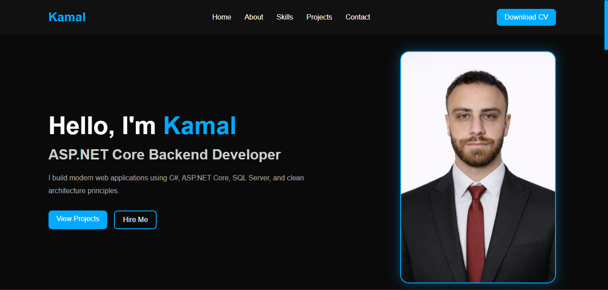
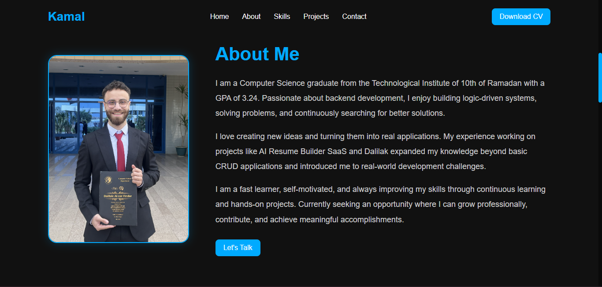
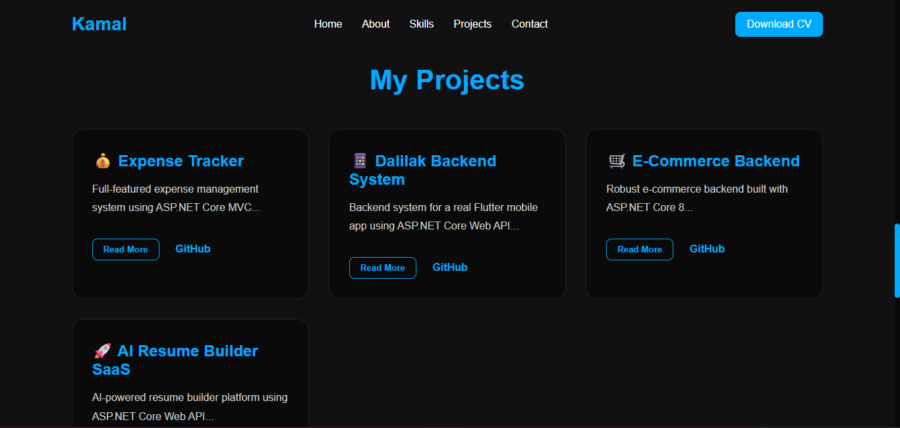
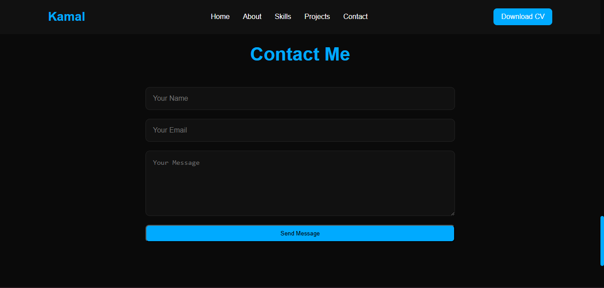

# Personal Portfolio Website


## Hero Banner Title

### Kamal Elsayed - .NET Backend Developer Portfolio

A modern, single-page, fully responsive personal portfolio built to present professional profile, technical skills, highlighted backend projects, downloadable CV, and direct contact options for recruiters, clients, and collaborators.

---

## Table of Contents

- [Overview](#overview)
- [Live Demo](#live-demo)
- [Screenshots](#screenshots)
- [Features](#features)
- [Tech Stack](#tech-stack)
- [Project Structure](#project-structure)
- [How to Run Locally](#how-to-run-locally)
- [Usage](#usage)
- [Responsive Design](#responsive-design)
- [Projects Showcase](#projects-showcase)
- [Contact Form Integration](#contact-form-integration)
- [Deployment](#deployment)
- [Customization](#customization)
- [Author](#author)
- [Contact](#contact)
- [License](#license)
- [Footer](#footer)

---

## Overview

This project is a production-ready frontend portfolio website designed for personal branding and professional visibility. It combines a clean dark interface with high-contrast blue accents, smooth section navigation, animated interactions, and practical contact tooling.

The website includes:
- A clear hero introduction and value proposition
- Detailed About section with personal and technical summary
- Skill highlights for backend and web technologies
- Real project cards with expandable descriptions and source links
- CV download access
- Contact form integrated with EmailJS for direct messaging
- Social profile links for GitHub, LinkedIn, and email

---

## Live Demo

- GitHub Pages: https://kamalelsayedjr.github.io/Portfolio/

---

## Screenshots

### Home Page


### About Section


### Projects Section


### Contact Section


---

## Features

- Single-page modern portfolio layout
- Professional dark UI with black and blue theme
- Fully responsive design across desktop, tablet, and mobile
- Sticky navigation bar
- Smooth scrolling section navigation
- Hero section with animated profile visual
- About Me section with personal overview
- Skills section using interactive cards
- Projects showcase with hover effects
- Read More / Show Less project descriptions
- Download CV action button
- Contact form with EmailJS integration
- Social links in footer
- Micro-interactions and transition effects
- Clean, readable content hierarchy

---

## Tech Stack

| Category | Technologies |
|---|---|
| Markup | HTML5 |
| Styling | CSS3 |
| Behavior | JavaScript |
| Email Service | EmailJS Browser SDK |
| Hosting | GitHub Pages |

---

## Project Structure

```text
portfolio/
├── index.html
├── css/
│   └── style.css
├── js/
│   └── main.js
├── assets/
│   ├── images/
│   └── cv/
└── README.md
```

---

## How to Run Locally

1. Clone the repository:

```bash
git clone https://github.com/KamalElsayedJR/Portfolio.git
```

2. Open the project folder:

```bash
cd Portfolio
```

3. Launch locally:
- Open `index.html` directly in your browser, or
- Use VS Code Live Server for auto-reload development.

No build step or package installation is required.

---

## Usage

- Use the top navigation bar to jump between sections.
- Click **View Projects** to move directly to the project showcase.
- Use **Read More** on any project card to expand technical details.
- Click **Download CV** to open the resume PDF.
- Submit the contact form to send a direct message using EmailJS.
- Use footer links to access GitHub, LinkedIn, or email contact.

---

## Responsive Design

The interface is optimized for different viewport sizes with CSS media queries and flexible layouts.

- Desktop: full horizontal hero and navigation layout
- Tablet: balanced spacing and wrapped section components
- Mobile: stacked hero layout, centered content blocks, adaptive navigation

Responsive behavior includes:
- Flexible grid systems in Skills and Projects sections
- Adaptive typography and spacing
- Mobile-specific navbar and hero adjustments

---

## Projects Showcase

### 1. Expense Tracker
Expense management system built with ASP.NET Core MVC and SQL Server.

### 2. Dalilak Backend System
Backend system for a real Flutter mobile application using ASP.NET Core Web API.

### 3. E-Commerce Backend
Scalable backend API with authentication, products, cart, orders, and payments.

### 4. AI Resume Builder SaaS
AI-powered SaaS platform for resume generation and subscriptions.

---

## Contact Form Integration

The contact form is connected through EmailJS and configured in `js/main.js` with:

- Public Key initialization
- Service ID
- Template ID
- Async form submission using `emailjs.sendForm(...)`

Current integration behavior:
- Shows a **Sending...** state during submission
- Displays success message after successful send
- Shows failure message if request fails
- Resets the form automatically on success

EmailJS setup checklist:
1. Create an EmailJS account.
2. Create an email service.
3. Create an email template mapped to `name`, `email`, and `message` fields.
4. Replace IDs in `js/main.js` if you migrate to a new EmailJS project.

---

## Deployment

### GitHub Pages

1. Push your code to the `main` branch.
2. Open repository settings on GitHub.
3. Navigate to **Pages**.
4. Set source to `Deploy from a branch`.
5. Select `main` branch and root folder.
6. Save and publish.

---

## Customization

You can quickly personalize the portfolio by editing:

- `index.html`
  - Name, title, description, and section text
  - Project card content and external links
  - Social profile URLs
- `css/style.css`
  - Color palette (`#0a0a0a`, `#111`, `#00aaff`)
  - Typography, spacing, and responsive breakpoints
  - Card/hover animations and transition timing
- `js/main.js`
  - Read More / Show Less interaction
  - EmailJS public key, service ID, and template ID

CV replacement:
- Replace `assets/cv/cv.pdf` with your latest resume file while keeping the same filename.

---

## Author

**Kamal Elsayed**  
.NET Backend Developer

---

## Contact

- Email: kamalelsayeddev@gmail.com
- GitHub: https://github.com/KamalElsayedJR
- LinkedIn: https://linkedin.com/in/kamal-elsayed-3b6089393

---

## License

This project is currently released without an open-source license. All rights reserved.

---

## Footer

Built and maintained by Kamal Elsayed.
Focused on clean backend engineering, practical architecture, and real-world product development.
